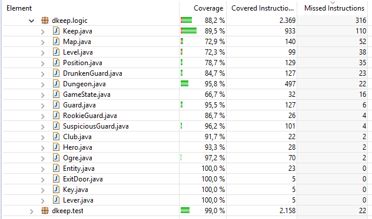
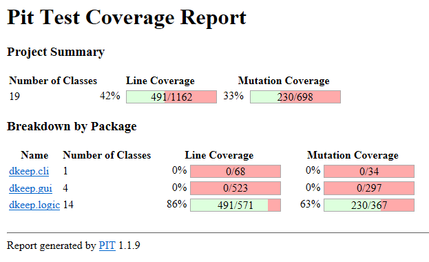

# LPOO1718_T5G6
Projects for FEUP's curricular unit LPOO.

Test coverage results: 

PitClipse mutation coverage results: 

## Team members

Francisco Manuel Canelas Filipe 201604601 up201604601@fe.up.pt

Pedro Miguel Sousa Fernandes 201603846 up201603846@fe.up.pt
